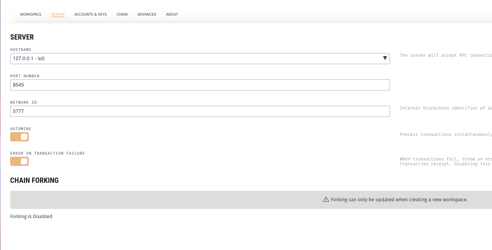
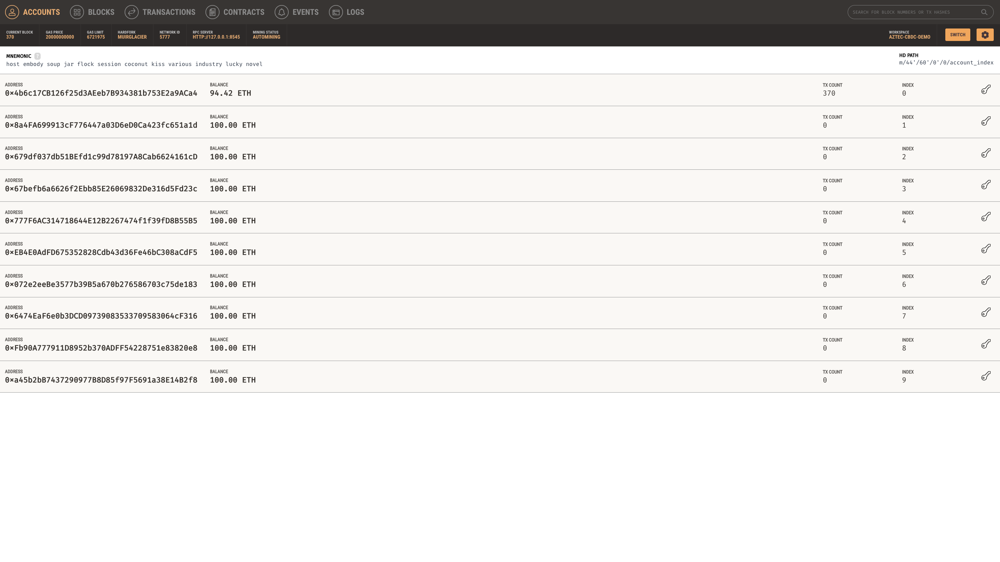

# aztec-ganache-starter-kit

A repository created for the XSGD-CBDC demo

### Requriements 

1. Node 

2. Truffle 

3. Yarn 

### Getting started

1. Start up Ganache GUI on `port 8545` , look at `setting up ganache GUI below`

2. Clone this repository in a seperate directory `git clone https://github.com/mihirmohan38/cbdc-plain.git`

3. Enter the right directory `cd cbdc-plain/cbdc-aztec`

4. Install the dependencies `yarn install`

5. Compile the contracts `yarn compile`

6. Deploy AZTEC! `yarn migrate`

7. Run the private payment demo. `yarn demo` 

### Setting up Ganache GUI 

1. Clone this repository `git clone https://github.com/trufflesuite/ganache-ui.git`, refer to their readme for a more detailed description on set up. 

2. Enter the directory `cd ganache-ui` 

3. Installing the dependenices `npm install` 

4. Run the program `npm run dev`, this should set up a local blockchain and open up the GUI

    - Start a new work space 
    
    - Go to settings and ensure ensure you are serving on `port 8545` 

    

5. Grab the private keys (two keys) generated from the Ganache GUI

6. Replace existing private keys for `bob` (line 18) and `sally` (line 21) in `./test/demo.js`. 